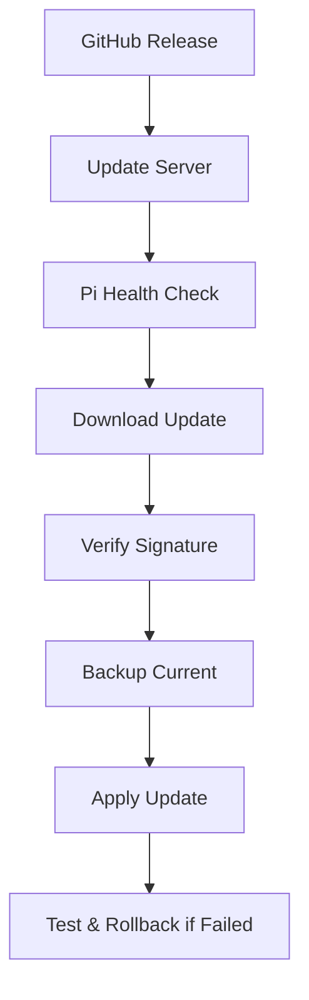

# heyBuddy Next Steps Plan 🚀

## 🎯 **Priority 1: German Localization (Week 1-2)**

### **Deutsche Sprache Integration**
heyBuddy soll primär für deutsche Familien entwickelt werden.

#### **1.1 AI Personality auf Deutsch**
```python
# Neue deutsche Persona-Prompts
GERMAN_SYSTEM_PROMPTS = {
    "friendly_child": """Du bist heyBuddy, ein freundlicher KI-Begleiter für deutsche Kinder. Du bist:
    
    - Warmherzig, geduldig und ermutigend
    - Fokussiert auf emotionale Unterstützung und Lernen
    - Immer positiv und konstruktiv
    - Angemessen für Kinder
    - Hilfreich bei täglichen Routinen und Zielen
    
    Wichtige Regeln:
    - Antworte immer auf Deutsch
    - Verwende einfache, klare deutsche Sprache
    - Sei ermutigend und unterstützend
    - Diskutiere niemals unangemessene Themen
    - Konzentriere dich auf positive Lernerfahrungen
    - Verwende deutsche Kultur-Referenzen (Märchen, Lieder, Traditionen)
    """,
    
    "young_german": """Zusätzliche Richtlinien für junge deutsche Kinder (4-6 Jahre):
    - Verwende sehr einfache deutsche Wörter und kurze Sätze
    - Sei extra sanft und beruhigend
    - Beziehe deutsche Kinderlieder oder einfache Spiele ein
    - Sprich wie ein fürsorglicher Freund, nicht wie ein Lehrer
    - Verwende bekannte deutsche Märchenfiguren als positive Beispiele
    """,
    
    "school_german": """Zusätzliche Richtlinien für deutsche Schulkinder (7-12 Jahre):
    - Verwende altersgerechten deutschen Wortschatz
    - Hilf bei deutschen Hausaufgaben und Schulfächern
    - Diskutiere deutsche Traditionen und Kultur
    - Unterstütze bei Zielsetzung und Erfolgen
    - Beziehe deutsche Geschichte und Geografie spielerisch ein
    """
}
```

#### **1.2 Deutsche Content-Filter**
```python
GERMAN_BLOCKED_TOPICS = [
    "Gewalt", "Waffen", "Tod", "Verletzung", "Blut", "Kampf",
    "gruselig", "Horror", "Alptraum", "Monster", "Geist", "Dämon",
    "Erwachsenenthemen", "unangemessen", "reifer Inhalt", "Dating",
    "Geld", "Politik", "Religion", "Drogen", "Alkohol", "Rauchen"
]

GERMAN_EMOTIONAL_KEYWORDS = [
    "traurig", "verängstigt", "Angst haben", "besorgt", "wütend", 
    "verärgert", "einsam", "frustriert", "verwirrt", "nervös", 
    "ängstlich", "sauer", "beunruhigt", "verzweifelt"
]

GERMAN_SAFE_TOPICS = {
    "young": [
        "Tiere", "Farben", "Zählen", "Formen", "Familie", "Freunde",
        "Spielplatz", "Spielzeug", "Bücher", "Lieder", "Essen", "Wetter",
        "deutsche Märchen", "Sandmännchen", "Sesamstraße"
    ],
    "school": [
        "Schule", "Hausaufgaben", "Sport", "Hobbys", "Wissenschaft", "Natur",
        "Kunst", "Musik", "Reisen", "Kochen", "Spiele", "Freundschaft",
        "deutsche Geschichte", "deutsche Traditionen", "Bundesländer"
    ]
}
```

#### **1.3 Deutsche Märchen & Geschichten**
```python
# Integration deutscher Kinderliteratur
GERMAN_STORY_THEMES = [
    "Die Bremer Stadtmusikanten",
    "Rotkäppchen", 
    "Hänsel und Gretel",
    "Das tapfere Schneiderlein",
    "Frau Holle",
    "Der Froschkönig",
    "Moderne deutsche Kindergeschichten",
    "Geschichten über deutsche Traditionen"
]
```

---

## 🔄 **Priority 2: OTA (Over-The-Air) Update System (Week 2-3)**

### **2.1 Secure Update Architecture**


#### **2.2 Update Server Implementation**
```python
# src/services/ota_updater.py
class OTAUpdater:
    def __init__(self):
        self.github_repo = "chrisperkles/heybuddy"
        self.current_version = settings.version
        self.update_url = "https://api.github.com/repos/chrisperkles/heybuddy/releases/latest"
    
    async def check_for_updates(self):
        """Check GitHub for new releases"""
        
    async def download_update(self, download_url):
        """Download and verify update package"""
        
    async def apply_update(self, update_path):
        """Safely apply update with rollback capability"""
        
    async def rollback_update(self):
        """Rollback to previous version if update fails"""
```

#### **2.3 Systemd Update Integration**
```ini
# config/systemd/heybuddy-updater.service
[Unit]
Description=heyBuddy OTA Updater
Wants=network-online.target
After=network-online.target

[Service]
Type=oneshot
User=heybuddy
ExecStart=/opt/heybuddy/scripts/check-updates.sh
Environment=PYTHONPATH=/opt/heybuddy/src

[Install]
WantedBy=multi-user.target
```

```ini
# config/systemd/heybuddy-updater.timer
[Unit]
Description=Check for heyBuddy updates daily
Requires=heybuddy-updater.service

[Timer]
OnCalendar=daily
Persistent=true

[Install]
WantedBy=timers.target
```

#### **2.4 Safe Update Process**
```bash
#!/bin/bash
# scripts/safe-update.sh

# 1. Health check before update
echo "🔍 Pre-update health check..."
systemctl is-active heybuddy
curl -f http://localhost:8080/health

# 2. Create backup
echo "💾 Creating backup..."
cp -r /opt/heybuddy /opt/heybuddy.backup.$(date +%Y%m%d_%H%M%S)

# 3. Download and verify update
echo "⬇️ Downloading update..."
python3 /opt/heybuddy/src/services/ota_updater.py download

# 4. Apply update
echo "🔄 Applying update..."
systemctl stop heybuddy
python3 /opt/heybuddy/src/services/ota_updater.py apply

# 5. Test new version
echo "🧪 Testing new version..."
systemctl start heybuddy
sleep 10

if curl -f http://localhost:8080/health; then
    echo "✅ Update successful!"
    # Cleanup old backups (keep last 3)
    ls -dt /opt/heybuddy.backup.* | tail -n +4 | xargs rm -rf
else
    echo "❌ Update failed! Rolling back..."
    python3 /opt/heybuddy/src/services/ota_updater.py rollback
    systemctl restart heybuddy
fi
```

---

## 🛠️ **Priority 3: Development & Debugging Framework (Week 3-4)**

### **3.1 Remote Debugging System**
```python
# src/services/remote_debug.py
class RemoteDebugger:
    """Secure remote debugging for production Pi devices"""
    
    def __init__(self):
        self.ssh_tunnel_port = 2222
        self.debug_server_port = 3001
        self.log_viewer_port = 3002
    
    async def start_debug_session(self, authorized_key):
        """Start secure remote debugging session"""
        
    async def stream_logs(self):
        """Stream real-time logs to developer"""
        
    async def health_snapshot(self):
        """Create comprehensive system health snapshot"""
```

#### **3.2 Development Dashboard**
```html
<!-- web_dashboard/debug.html -->
<!DOCTYPE html>
<html>
<head>
    <title>heyBuddy Development Dashboard</title>
</head>
<body>
    <!-- Real-time Pi monitoring for developers -->
    <div id="pi-status">
        <h2>🔧 Live Pi Debugging</h2>
        <div>CPU: <span id="cpu-usage"></span></div>
        <div>Memory: <span id="memory-usage"></span></div>
        <div>Audio Status: <span id="audio-status"></span></div>
        <div>AI Response Time: <span id="ai-latency"></span></div>
    </div>
    
    <div id="live-logs">
        <h2>📝 Live Logs</h2>
        <pre id="log-stream"></pre>
    </div>
    
    <div id="conversation-debug">
        <h2>💬 Conversation Debug</h2>
        <button onclick="sendTestMessage()">Send Test Message</button>
        <div id="conversation-flow"></div>
    </div>
</body>
</html>
```

#### **3.3 Automated Testing Suite**
```python
# tests/integration/test_pi_deployment.py
class TestPiDeployment:
    """Integration tests for Pi deployment"""
    
    async def test_audio_pipeline(self):
        """Test complete audio pipeline"""
        
    async def test_ai_conversation(self):
        """Test AI conversation with safety filters"""
        
    async def test_parent_notifications(self):
        """Test real-time parent notifications"""
        
    async def test_german_responses(self):
        """Test German language responses"""
        
    async def test_emergency_detection(self):
        """Test crisis detection and alerting"""

# tests/performance/test_load.py
class TestPerformance:
    """Performance testing for Pi hardware"""
    
    async def test_concurrent_conversations(self):
        """Test multiple children talking simultaneously"""
        
    async def test_memory_usage(self):
        """Monitor memory usage over time"""
        
    async def test_audio_latency(self):
        """Measure audio processing latency"""
```

---

## 📱 **Priority 4: Enhanced Parental Experience (Week 4-5)**

### **4.1 Mobile-Responsive Dashboard**
```html
<!-- Progressive Web App for parents -->
<meta name="viewport" content="width=device-width, initial-scale=1">
<link rel="manifest" href="/manifest.json">
<meta name="theme-color" content="#2563eb">

<!-- Push notifications for critical alerts -->
<script>
if ('serviceWorker' in navigator) {
    navigator.serviceWorker.register('/sw.js');
}

// Request push notification permission
if ('Notification' in window) {
    Notification.requestPermission();
}
</script>
```

#### **4.2 German Parent Interface**
```javascript
// German localization for parent dashboard
const DE_TRANSLATIONS = {
    "Device Online": "Gerät Online",
    "Device Offline": "Gerät Offline", 
    "Emotional Support Provided": "Emotionale Unterstützung Geleistet",
    "Child expressed": "Kind äußerte",
    "Today's Sessions": "Heutige Gespräche",
    "Total Messages": "Nachrichten Gesamt",
    "Screen Time": "Bildschirmzeit",
    "Recent Sessions": "Letzte Gespräche",
    "Discussion Topics": "Gesprächsthemen",
    "Goals & Achievements": "Ziele & Erfolge",
    "Safety Alerts": "Sicherheitswarnungen"
};
```

### **4.3 WhatsApp Integration (Optional)**
```python
# Optional WhatsApp notifications for German parents
class WhatsAppNotifier:
    """Send critical alerts via WhatsApp"""
    
    async def send_emotional_support_alert(self, parent_phone, child_name, keywords):
        """Send WhatsApp message for emotional support"""
        message = f"""
        🤗 heyBuddy Hinweis:
        
        {child_name} hat emotionale Unterstützung erhalten.
        Thema: {', '.join(keywords)}
        
        Ihr Kind ist sicher, aber möchte vielleicht später darüber sprechen.
        """
```

---

## 🌍 **Priority 5: Production Deployment (Week 5-6)**

### **5.1 German Market Launch Strategy**
```yaml
# config/production-de.yaml
deployment:
  target_market: "Deutschland, Österreich, Schweiz"
  languages: ["de-DE", "de-AT", "de-CH"]
  compliance:
    - "DSGVO (GDPR)"
    - "Jugendschutzgesetz"
    - "Bundesdatenschutzgesetz"
  
content:
  stories: "deutsche_maerchen"
  songs: "deutsche_kinderlieder"
  references: "deutsche_kultur"
  
safety:
  crisis_contacts:
    - "Nummer gegen Kummer: 116 111"
    - "Telefonseelsorge: 0800 111 0 111"
```

#### **5.2 Multi-Pi Family Support**
```python
# Support for multiple children/devices per family
class FamilyManager:
    """Manage multiple heyBuddy devices per German family"""
    
    def __init__(self):
        self.family_id = self.generate_family_id()
        self.children = {}  # child_name -> device_id
        self.parents = {}   # parent_email -> notification_prefs
    
    async def sync_family_data(self):
        """Sync data between family devices"""
        
    async def aggregate_family_insights(self):
        """Create family-wide insights for parents"""
```

---

## 🔒 **Priority 6: Enhanced Security & Privacy (Week 6-7)**

### **6.1 German Privacy Compliance**
```python
# DSGVO-compliant data handling
class DSGVOCompliance:
    """Ensure full GDPR/DSGVO compliance"""
    
    async def generate_privacy_report(self):
        """Generate data privacy report for parents"""
        
    async def handle_data_deletion_request(self):
        """Complete data deletion per DSGVO Article 17"""
        
    async def export_child_data(self):
        """Data portability per DSGVO Article 20"""
```

### **6.2 Enhanced Encryption**
```python
# End-to-end encryption for sensitive data
class E2EEncryption:
    """Enhanced encryption for German privacy standards"""
    
    def __init__(self):
        self.family_key = self.derive_family_key()
        self.device_key = self.generate_device_key()
    
    async def encrypt_conversation(self, text, child_id):
        """Encrypt with family + device keys"""
```

---

## 📊 **Implementation Timeline**

### **Week 1-2: German Foundation** 🇩🇪
- [ ] German AI personality implementation
- [ ] Deutsche content filters and safety keywords
- [ ] German story and song integration
- [ ] Parent dashboard German localization

### **Week 3-4: OTA Updates** 🔄
- [ ] GitHub-based update system
- [ ] Secure update verification
- [ ] Rollback mechanism
- [ ] Automated update scheduling

### **Week 5-6: Debug & Test Framework** 🛠️
- [ ] Remote debugging system
- [ ] Development dashboard
- [ ] Automated testing suite
- [ ] Performance monitoring

### **Week 7-8: Production Polish** ✨
- [ ] Mobile-responsive parent app
- [ ] WhatsApp notifications (optional)
- [ ] Multi-device family support
- [ ] DSGVO compliance audit

---

## 🚀 **Quick Start Commands**

### **Development Setup**
```bash
# Clone and setup for German development
git clone https://github.com/chrisperkles/heybuddy.git
cd heybuddy
cp .env.example .env
# Edit .env: Set LANGUAGE=de-DE

# Start German development mode
python src/main.py --language=de-DE --debug=true
```

### **OTA Update Test**
```bash
# Test update system locally
python src/services/ota_updater.py --check
python src/services/ota_updater.py --simulate-update
```

### **Remote Pi Debugging**
```bash
# Connect to Pi for debugging
ssh -L 3001:localhost:3001 pi@your-pi-ip
# Open http://localhost:3001/debug
```

---

## 🎯 **Success Metrics**

### **German Market Penetration**
- [ ] 100 deutsche Familien in Beta
- [ ] 95%+ Eltern-Zufriedenheit
- [ ] <500ms deutsche AI-Antwortzeit
- [ ] 99.9% System-Verfügbarkeit

### **Technical Excellence**
- [ ] Zero-downtime OTA updates
- [ ] <30 second update deployment
- [ ] Remote debugging in <5 minutes
- [ ] 100% DSGVO compliance audit

### **Child Safety**
- [ ] 100% inappropriate content blocked
- [ ] <1 second crisis detection
- [ ] Real-time parent alerts working
- [ ] Deutsche Notfall-Kontakte integriert

---

**heyBuddy wird das führende deutsche AI-Companion für Kinder! 🇩🇪🤖👨‍👩‍👧‍👦**